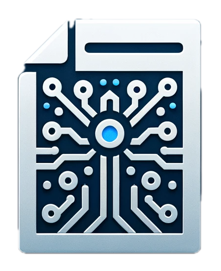

<p align="center">
  
  <h1 align="center">LetterLinc</h1>
  <p align="center">Personalized AI Cover Letter Generator</p>
</p>

## Introduction

LetterLinc is a cutting-edge SaaS application designed to streamline the cover letter creation process. Leveraging the power of AI, LetterLinc enables users to generate personalized cover letters by simply uploading their resume and the job description they are applying for. Our application analyzes the content of your resume and the job description, then crafts a tailored cover letter that highlights your qualifications and readiness for the role. With LetterLinc, users can save time, enhance their job application process, and increase their chances of landing their dream job.

## Features

*   **AI-Powered Cover Letter Generation**: Utilize advanced AI to create personalized cover letters based on your resume and job description.
*   **Resume Upload**: Easily upload your resume in PDF format.
*   **PDF Extraction and Analysis**: Extract and analyze text from uploaded resumes, storing the data for optimized cover letter creation.
*   **Save, Export, and Edit**: Save your cover letters, export them as PDFs, or make further edits as needed.
*   **User Accounts**: Sign up for an account to manage your cover letters, allowing for easy access and modifications.
*   **Vector Data Storage**: Employ Pincone Vector Store to maintain and utilize embedding data from resumes, enhancing the relevancy of generated cover letters.

## Technology Stack

*   **Frontend**: Next.js with TypeScript - for a robust and type-safe user interface.
*   **Backend**: Firebase - provides a scalable backend solution, including authentication, database, and storage services.
*   **AI and Machine Learning**: Custom AI algorithms for analyzing resumes and job descriptions, with embedding data stored in Pincone Vector Store.

## Screenshots


## Getting Started

Follow these instructions to set up a local development environment. Make sure you have Node.js (latest LTS version) and a Firebase account before you start.

### Installation

1. **Clone the repository:**

```bash
git clone https://github.com/AshishBarvaliya/LetterLinc.git
```

2. **Navigate to the project directory:**

```bash
cd LetterLinc
```

3. **Install dependencies:**

```bash
npm install
```

4.  **Set up Firebase:**

*   Create a `.env` file in the root of your project.
*   Add your Firebase project configuration to `.env`. For example:

```markdown
# Firebase Configuration
NEXT_PUBLIC_FIREBASE_API_KEY=your_firebase_api_key
NEXT_PUBLIC_FIREBASE_AUTH_DOMAIN=your_firebase_auth_domain
NEXT_PUBLIC_FIREBASE_PROJECT_ID=your_firebase_project_id
NEXT_PUBLIC_FIREBASE_STORAGE_BUCKET=your_firebase_storage_bucket
NEXT_PUBLIC_FIREBASE_MESSAGING_SENDER_ID=your_firebase_messaging_sender_id
NEXT_PUBLIC_FIREBASE_APP_ID=your_firebase_app_id

# OpenAI Configuration
OPENAI_API_KEY=your_openai_api_key

# Pinecone Configuration
PINECONE_API_KEY=your_pinecone_api_key
PINECONE_PROJECT_ID=your_pinecone_project_id
PINECONE_INDEX_NAME=your_preferred_index_name
```

5.  **Run the development server:**

```bash
npm run dev
```

Navigate to `http://localhost:3000` to view your project running locally.


## Usage

1.  **Create an Account/Login**: Sign up or log in to access the cover letter generation features.
2.  **Upload Your Resume**: Navigate to the resume upload section and upload your resume as a PDF.
3.  **Enter Job Description**: Input the job description for which you are applying.
4.  **Generate Cover Letter**: Click the generate button to produce your personalized cover letter.
5.  **Save, Export, or Edit**: Once generated, you can save your cover letter, export it as a PDF, or make further edits.


### Contribution

Feel free to contribute to the project by submitting pull requests or opening issues for any bugs or feature requests. Your feedback and contributions are highly appreciated!

